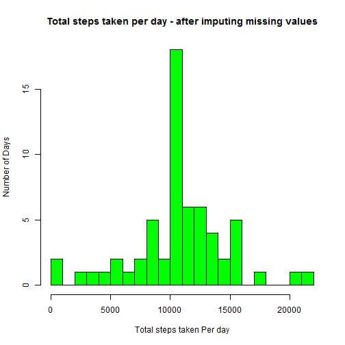

### Introduction

This is submission for JHU Coursera Course "Reproducible Research".  It is required to write the report and answer questions using RMD format.  Commit the completed PA1_template.Rmd file to the master branch of  GitHub repository for peer review. 

**Data**

The data for this assignment can be downloaded from the course web site.  Dataset: Activity monitoring data

The variables included in this dataset are:

 - steps: Number of steps taking in a 5-minute interval (missing values are coded   as NA)


 - date: The date on which the measurement was taken in YYYY-MM-DD format


 - interval: Identifier for the 5-minute interval in which measurement was taken


The dataset is stored in a comma-separated-value (CSV) file and there are a total of 17,568 observations in this dataset.


**Loading and preprocessing the data**


```r
## set working directory
setwd ("c:/temp/ReproducibleResearch/")

## Loading and preprocessing the data
Data <- read.csv ("activity.csv", header = TRUE, sep=",", colClasses = c("numeric", "character", "numeric"))
```

### What is mean total number of steps taken per day

**1. Calculate the totla number of steps taken per day and make a histogram**


```r
Total <- aggregate(steps ~ date, data = Data, sum, na.rm = TRUE)
names(Total)[2] <- "sum_steps"

###Review dataset
head(Total, 5)
```

```
##         date sum_steps
## 1 2012-10-02       126
## 2 2012-10-03     11352
## 3 2012-10-04     12116
## 4 2012-10-05     13294
## 5 2012-10-06     15420
```

```r
### make histogram plot

hist(Total$sum_steps, main = "Total steps taken per day", xlab = "Total steps taken per day", ylab = "Number of Days", breaks =20, col = "blue")
```

 

**2. Calculate and report the mean and median of the total number of steps taken per day**


```r
### mean of the total number of steps taken per day
meanTotal <- mean (Total$sum_steps, na.rm = TRUE)
meanTotal
```

```
## [1] 10766.19
```

```r
### median of the total number of steps taken per day
medianTotal <- median (Total$sum_steps, na.rm = TRUE)
medianTotal
```

```
## [1] 10765
```

### What is the average daily activity pattern?

**1. Make a time series plot**


```r
TimeSeries <- tapply(Data$steps, Data$interval, mean, na.rm = TRUE)

plot(row.names(TimeSeries), TimeSeries, type = "l", xlab = "5 minute interval", 
    ylab = "Average across all Days", main = "Average number of steps taken", 
    col = "blue")
```

 

**2. Calculate which interval Contains the maximum number of steps**


```r
Max_Interval <- which.max(TimeSeries)
names(Max_Interval)
```

```
## [1] "835"
```

### Imputing missing values

**1. Calculate and report the total number of missing values **


```r
DataNA <- sum(is.na(Data))
DataNA
```

```
## [1] 2304
```

**2. Devise a strategy for filling in all of the missing values in the dataset.**

*Replace NAs with the mean for that 5 minute interval.*   


```r
AverageSteps <- aggregate(steps ~ interval, Data, FUN = mean)

Replace_NA <- numeric()
for (i in 1:nrow(Data)) {
    obs <- Data[i, ]
    if (is.na(obs$steps)) {
        steps <- subset(AverageSteps, interval == obs$interval)$steps
    } else {
        steps <- obs$steps
    }
    Replace_NA <- c(Replace_NA, steps)
}
```

**3. Create a new dataset with filling data**


```r
newData <- Data
newData$steps <- Replace_NA

newTotal <- aggregate(steps ~ date, data = newData, sum, na.rm = TRUE)
names (newTotal) [2]<- "sum_steps" 

### Review new dataset
head(newTotal, 5)
```

```
##         date sum_steps
## 1 2012-10-01  10766.19
## 2 2012-10-02    126.00
## 3 2012-10-03  11352.00
## 4 2012-10-04  12116.00
## 5 2012-10-05  13294.00
```

**4a. Make a histogram of the total number of steps taken daily**


```r
### create historgram 

hist(newTotal$sum_steps, main = "Total steps taken per day - after imputing missing values", xlab = "Total steps taken Per day", ylab = "Number of Days", breaks =20, col = "green")
```

 

**4b. Calculate and report the mean and median total number of steps taken per day**


```r
### mean of the new total number of steps taken per daythe new dataset
meannewTotal <- mean(newTotal$sum_steps)
meannewTotal
```

```
## [1] 10766.19
```

```r
### median of the new total number of steps taken per day
mediannewTotal <- median(newTotal$sum_steps)
mediannewTotal
```

```
## [1] 10766.19
```
**Do these values differ from the estimates from the first part of the assignment?**

mean(total) = 10766.19, while mean(newtotal) = 10766.19. Two datasets have the same mean value.

median(total) = 10765, while median(newtotal) = 10766.19.  Two datasets have slightly difference median.

**What is the impact of imputing missing data on the estimates of the total daily number of steps?**

It depends on what strategy used to fill missing values . In this case the average for a given interval is used so there was no significant difference.  Plot shape of these two also looks alike.   


### Are there differences in activity patterns between weekdays and weekends?

**1. Create a new factor variable in the dataset with two levels - "weekday" and "weekend"**

*Using the new dataset with imputed missing values*


```r
day <- weekdays(as.Date(newData$date))

dayType <- vector()

for (i in 1:nrow(newData)) {
    if (day[i] == "Saturday" | day[i] == "Sunday") {
        dayType[i] <- "Weekend"
    } else {
        dayType[i] <- "Weekday"
    }
}

newData$dayType <- dayType

newData$dayType <- factor(newData$dayType)
```

**2. Make a panel plot containing a time series plot**


```r
stepsByDayType <- aggregate(steps ~ interval + dayType, data = newData, mean)
names(stepsByDayType) <- c("interval", "dayType", "mean_steps")

###Review new dataset
head(stepsByDayType, 5)
```

```
##   interval dayType mean_steps
## 1        0 Weekday 2.25115304
## 2        5 Weekday 0.44528302
## 3       10 Weekday 0.17316562
## 4       15 Weekday 0.19790356
## 5       20 Weekday 0.09895178
```

*Plot time series*


```r
library(lattice)

xyplot(mean_steps ~ interval | dayType, stepsByDayType, type = "l", layout = c(1, 2), xlab = "5 minute Interval", ylab = "Average number of steps")
```

 

*Comparing the graphs above, People are more active on weekend mornings around 8 - 9 AM*


